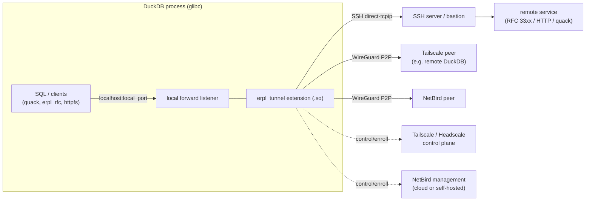
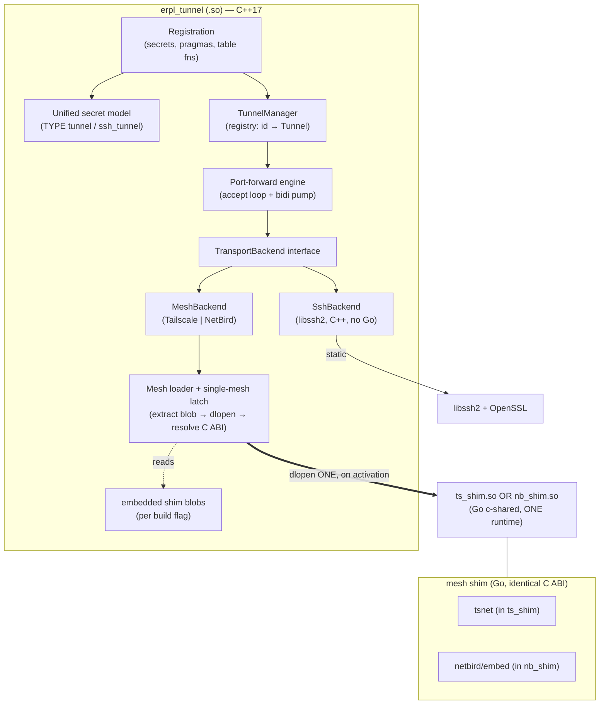
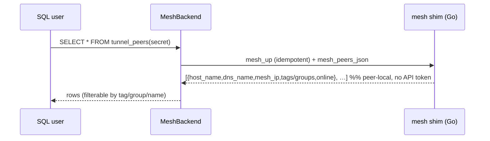

# High-Level Design — `erpl-tunnel`

> Architecture (arc42) for a zero-dependency DuckDB extension that tunnels
> raw TCP over **SSH**, **Tailscale**, or **NetBird**.

| | |
|---|---|
| **Document** | High-Level Design (HLD), arc42 |
| **Status** | Draft for review |
| **Date** | 2026-07-23 |
| **Companion** | [`BRD.md`](BRD.md) — Business Requirements |
| **Scope** | Coarse architecture & decisions only. Class-level design, signatures, and file layout are left to the implementing agent. |

---

## 1. Introduction & goals

`erpl-tunnel` extracts erpl's SSH-tunnel module into a standalone DuckDB
extension and adds two in-process mesh-VPN backends. A single loadable
artifact lets a DuckDB instance reach a remote TCP endpoint — the *quack*
remote protocol, SAP RFC, or HTTP — across NAT/firewalls with one pasted
credential and no external daemon.

### 1.1 Quality goals (top 5, drives the architecture)

| # | Quality | Concrete meaning | Architectural lever |
|---|---------|------------------|---------------------|
| Q1 | **Zero dependency** | One loadable file; nothing to install | Static libssh2/OpenSSL + the selected mesh Go `c-shared` shim(s) embedded and lazily `dlopen`'d (§4, ADR-001) |
| Q2 | **Ease of use** | ≤ 3 SQL statements happy path | Unified secret + `tunnel_create`; sane defaults (§8.1) |
| Q3 | **Robustness** | Idempotent, self-healing bring-up, deterministic teardown | Backend state machine + supervised lifecycle (§6, §8.5) |
| Q4 | **Error clarity** | Actionable message for every failure | Central error taxonomy at the C↔Go and SQL boundaries (§8.6) |
| Q5 | **Protocol-agnostic** | quack/RFC/HTTP unchanged | Raw-TCP port-forward engine over a backend `Dial` abstraction (§8.3) |

## 2. Constraints

- **C1** Target host is DuckDB, which `dlopen`s the extension `.so`/`.dylib`.
- **C2** Both mesh SDKs are **Go**; **one Go runtime per process**. Tailscale
  and NetBird are never needed simultaneously, so each is a separate Go
  `c-shared` shim and **at most one is loaded per process** (ADR-001, ADR-011).
- **C3** **glibc + pthreads + dynamic loader required**; musl/static-only is
  unsupported (Go cgo limitation).
- **C4** DuckDB extension build uses **CMake + vcpkg + extension-ci-tools**;
  C++17.
- **C5** No external daemon, no root, no kernel TUN at runtime (Q1).
- **C6** License/distribution to be resolved (BRD R2); does not affect code
  architecture, only packaging.
- **C7** Real-service, no-mock TDD (repo convention) → hermetic control
  servers (Headscale / self-hosted NetBird) must be dockerisable.

## 3. Context & scope



**In scope:** the extension as a mesh/SSH *node* and TCP forwarder.
**Out of scope:** control-plane administration, SOCKS/transparent proxying,
app-level metadata services (BRD NG1–NG3).

## 4. Solution strategy

| Problem | Strategy |
|---------|----------|
| Zero dependency (Q1) | Statically link libssh2 + OpenSSL (vcpkg); **embed** the selected mesh Go `c-shared` shim(s) as blobs inside the single loadable extension. Nothing external at runtime. |
| Two Go SDKs, one runtime (C2) | **Two independent shims with an identical C ABI** — `ts_shim` (vendored `tsnet`) and `nb_shim` (`netbird/client/embed`), each `-buildmode=c-shared`. Only one is ever `dlopen`'d per process (ADR-011), so a single Go runtime is loaded and the runtimes never collide. |
| Lazy activation (BRD FR-24/25) | SSH (C++) needs no Go and loads instantly. A mesh shim is extracted from its embedded blob and `dlopen`'d **on first activation**, then held by a process-global **single-mesh latch**. |
| Uniform transport (Q5) | A backend-agnostic **`TransportBackend`** interface in C++ with the sole primitive `Dial(host, port) → Stream`. SSH, Tailscale, NetBird all implement it. A single **port-forward engine** consumes it. |
| Ease of use (Q2) | One unified `SECRET TYPE tunnel` (+ `ssh_tunnel` alias); minimal pragmas; defaults for ports/timeouts/URLs/state dirs. |
| Discovery (BRD FR-17) | Peer-local status from the mesh SDK, surfaced as `tunnel_peers()`; filter by tag/group/name. |
| Robustness (Q3) | Explicit backend **state machine**, supervised lifecycle, bounded-backoff bring-up, deterministic teardown with per-connection tracking. |

## 5. Building-block view

### 5.1 Level 1 — inside the extension



| Block | Responsibility |
|-------|----------------|
| **Registration** | DuckDB entrypoint; registers the secret type(s), pragmas, and table functions. |
| **Unified secret model** | Parse/validate/redact per-backend credentials + options; look up by name. |
| **TunnelManager** | Process-global registry of active tunnels; assigns ids; owns backend nodes (one shared mesh node per secret/identity, reused across tunnels). |
| **Port-forward engine** | Backend-agnostic: bind `127.0.0.1:local_port`, accept, and pump bytes bidirectionally to a `Stream` from `backend.Dial(remote_host, remote_port)`. Tracks per-connection lifecycle. |
| **TransportBackend** | Interface: `EnsureUp()`, `Dial(host,port)→Stream`, `Peers()`, `Self()`, `Close()`. |
| **SshBackend** | libssh2 session + `direct-tcpip` channel per connection; password/key auth. No `Peers()` (returns empty/unsupported). |
| **MeshBackend** | C++ backend that drives whichever shim the loader activated (via the C ABI); `Dial` → mesh fd; `Peers/Self` → status JSON. |
| **Mesh loader + single-mesh latch** | On first mesh activation: extract the embedded shim blob to a temp file, `dlopen` it, resolve the `mesh_*` symbols. Refuses a second, different mesh in the same process (ADR-011). SSH never triggers it. |
| **mesh shim (Go, `c-shared`)** | `ts_shim` (vendored `tsnet`) and `nb_shim` (`netbird/embed`) — separate `.so`/`.dylib`, **identical C ABI**; expose handles as ints and streams as OS fds. Exactly one is loaded per process. |

### 5.2 Mesh shim C ABI (identical for `ts_shim` and `nb_shim`; illustrative)

Handles are ints; streams are OS file descriptors (the `libtailscale` fd
trick, reusable since it's BSD-3) so C++ pumps bytes with `read`/`write` and
never touches Go memory. Both shims export the **same** symbols, so the C++
loader resolves one set regardless of which mesh is active.

```c
/* mesh_kind() reports which mesh this shim is (1=tailscale 2=netbird) */
int        mesh_kind(void);
mesh_node  mesh_new(void);
int mesh_set_str(mesh_node, const char* key, const char* val); /* auth_key,
      setup_key, hostname, tags, groups, control_url, mgmt_url, state_dir */
int mesh_set_bool(mesh_node, const char* key, int val);        /* ephemeral */
int mesh_up(mesh_node);                       /* enroll+connect, blocks til usable */
int mesh_dial(mesh_node, const char* host, int port, int* fd_out);
int mesh_peers_json(mesh_node, char* buf, size_t len, size_t* need);
int mesh_self_json (mesh_node, char* buf, size_t len, size_t* need);
int mesh_errmsg(mesh_node, char* buf, size_t len);   /* last error, human text */
int mesh_close(mesh_node);
```

- **One symbol set, two shims:** because `ts_shim` and `nb_shim` export the
  identical ABI, the C++ `MeshBackend` binds one set of function pointers from
  whichever `.so` the loader `dlopen`'d. `tsnet` and `netbird/embed` have
  near-identical `Dial`/`Listen`/`Status` shapes, so one wrapper fits both.
- **Streams as fds:** the port-forward engine treats SSH channels and mesh
  dials uniformly as byte streams; no backend-specific pump.
- **No two runtimes:** only one shim `.so` is ever loaded (§6.5 latch), so the
  `#65050` two-Go-runtime crash cannot occur.

## 6. Runtime view

> **Naming note.** This document was written when the only pragma was
> `tunnel_create`. That pragma is now called **`tunnel_import`** (consume a remote
> service), with `tunnel_create` kept as a deprecated alias, and it has a sibling
> **`tunnel_export`** (publish a local port onto the network) — see
> [ADR-014](ADR.md). Read `tunnel_create` below as `tunnel_import`; the flows are
> unchanged.

### 6.1 `tunnel_create` over a mesh backend

```mermaid
sequenceDiagram
  participant U as SQL user
  participant R as Registration/Manager
  participant S as Secret store
  participant M as MeshBackend
  participant L as Loader+latch
  participant G as mesh shim (Go)
  participant P as Port-forward engine
  U->>R: PRAGMA tunnel_create(secret,remote_host,remote_port,local_port,timeout)
  R->>S: lookup secret (else actionable error, no default)
  R->>M: EnsureUp(secret)   %% idempotent: reuse node if already up
  M->>L: activate(kind)  %% first time: extract blob→dlopen; else check latch
  L-->>M: shim ready (or 'other mesh already active' / 'not in this build')
  M->>G: mesh_new + mesh_set_* + mesh_up
  G-->>M: up (or typed error: bad key / offline control / timeout)
  R->>P: start listener 127.0.0.1:local_port, backend=M, remote=host:port
  P-->>R: listening (or 'port in use')
  R->>P: probe connect within timeout
  R-->>U: (tunnel_id, 'Listening on 127.0.0.1:local_port')
  Note over P,G: per client: P accepts → M.Dial→mesh_dial(fd) → bidi pump
```

### 6.2 SSH path

Identical, except no loader/shim is involved (SSH is pure C++): `EnsureUp`
opens a libssh2 session (handshake + auth) and `Dial` opens a `direct-tcpip`
channel. No Go is ever loaded on this path.

### 6.3 Discovery



### 6.4 Node bring-up state machine (per identity)

`Uninitialised → Configuring → Enrolling → Up → Degraded ⇄ Up → Closing →
Closed`. `Enrolling` prints the interactive login URL when no key is set
(dev). `Degraded` (control unreachable / peer offline) retries with bounded
backoff; `EnsureUp` is idempotent across all states.

### 6.5 Lazy activation & the single-mesh latch

First activation of a mesh backend: the loader **extracts** that shim's
embedded blob to a per-process temp file (mode `0700`, unlinked/swept on
close), **`dlopen`s** it, and resolves the `mesh_*` symbols. A process-global
latch records the active `mesh_kind`:

- **SSH-only sessions** never reach the loader → **no Go in the process**.
- **Second, different mesh** in the same process → refused:
  `Tunnel: Tailscale is active in this DuckDB process; NetBird cannot be
  loaded — start a new session.` (FR-26.)
- **Backend not in this build** (per the bundle flag) → refused with the
  install hint (FR-27), not a `dlsym` error.
- **Same mesh again** → reuses the already-loaded shim (idempotent).

## 7. Deployment view

- **Artifact:** one `erpl_tunnel.duckdb_extension` per (OS, arch, DuckDB
  version, **bundle flag**). Contents: C++ extension + static libssh2/OpenSSL
  + the embedded mesh shim blob(s) selected by `MESH_BACKEND`.
- **Bundle flag (ADR-012):** `MESH_BACKEND=ssh|tailscale|netbird|both`.
  `ssh` carries **no Go** (smallest, ~parity build). `tailscale`/`netbird`
  embed one shim; `both` embeds two (runtime picks via the latch). All share
  the single name `erpl_tunnel`.
- **Build matrix (cgo → per-target C toolchain):** `linux/amd64`,
  `linux/arm64`, `osx/amd64`, `osx/arm64`, `windows/amd64`. musl and wasm are
  SSH-only (Go cgo `c-shared` needs glibc). Windows landed after BRD NG5/R6 was
  written — see [ADR-013](ADR-013-windows-mesh.md); on Windows the shim is a
  mingw-built `.dll` loaded with `LoadLibraryW`, and the local stream pair is a
  loopback TCP pair rather than an `AF_UNIX` socketpair.
- **Toolchain:** CMake + vcpkg (static triplet) for the C/C++ side;
  `go build -buildmode=c-shared` (Go ≥ 1.26 — see ADR-013; 1.25.x does not run
  `init()` in a c-shared DLL on Windows) per shim (`ts_shim`, `nb_shim`),
  invoked from CMake as custom targets; each resulting `.so`/`.dylib` is
  **code-signed (macOS)** and embedded into the extension as a byte blob.
- **No runtime files** beyond the extension itself, the **extracted shim**
  (temp, on first mesh activation, swept on close), and the mesh **state dir**
  (created on demand; ephemeral mode → temp dir).

## 8. Crosscutting concepts

### 8.1 SQL surface (unified across backends)

```sql
-- Secrets (one type; backend discriminator). ssh_tunnel kept as alias.
CREATE SECRET s_ssh (TYPE tunnel, backend 'ssh',
    ssh_host '…', ssh_port 22, ssh_user '…',
    private_key_path '…', passphrase '…');           -- or password '…'
CREATE SECRET s_ts  (TYPE tunnel, backend 'tailscale',
    auth_key 'tskey-…', hostname 'duckdb-eu-1', tags 'tag:duckdb',
    ephemeral true, control_url '' /*empty=Tailscale cloud*/, state_dir '…');
CREATE SECRET s_nb  (TYPE tunnel, backend 'netbird',
    setup_key '…', hostname 'duckdb-eu-1', groups 'duckdb',
    ephemeral true, management_url '' /*empty=NetBird cloud*/, state_dir '…');

-- Lifecycle (names kept erpl-compatible)
PRAGMA tunnel_create(secret = 's_ts',
    remote_host = 'duckdb-eu-shard3', remote_port = 4213,
    local_port = 9000, timeout = 30);              -- → (tunnel_id, message)
SELECT * FROM tunnels();                              -- active local tunnels
PRAGMA tunnel_close(1);
PRAGMA tunnel_close_all;

-- Discovery / identity (mesh backends)
SELECT * FROM tunnel_peers(secret = 's_ts');        -- peer-local enumeration
SELECT * FROM tunnel_self(secret = 's_ts');         -- this node's name/ip/tags
```

`tunnels()` columns: `tunnel_id, backend, remote_host, remote_port,
local_port, bind_addr, status`. `tunnel_peers()` columns: `backend,
host_name, dns_name, mesh_ip, tags, online`.

### 8.2 Unified secret model

One parser with a `backend` switch; per-backend required/optional fields;
redacted set `{password, passphrase, private_key_path, auth_key,
setup_key}`. A missing secret is a hard, actionable error — **never** the
silent localhost/agent default erpl uses today.

### 8.3 Port-forward engine (the reuse core)

Backend-agnostic. `bind(127.0.0.1, local_port)` (opt-in all-interfaces),
non-blocking accept loop with a shutdown selector, and per accepted socket a
tracked worker that owns a `Stream = backend.Dial(remote_host, remote_port)`
and runs a 16 KB bidirectional pump. Closing a tunnel signals all its
workers and joins them (fixes erpl's detached-thread leak). SSH `Stream` =
libssh2 channel; mesh `Stream` = fd from `mesh_dial`.

### 8.4 Discovery model (tags/naming only — ADR-004)

- **Announce = enroll.** A node advertises itself by its **hostname** and
  **tag** (Tailscale) / **group** (NetBird), set in the secret. No separate
  listener, no JSON descriptor (BRD NG2).
- **Discover = peer-local status.** `tunnel_peers()` reads the SDK's local
  netmap/status (`tsnet` `LocalClient().Status()`; NetBird
  `Status()`/`GetLatestSyncResponse()`) — **no control-plane token**.
- **Addressing.** Use `dns_name` (MagicDNS / NetBird DNS-label) or `mesh_ip`
  as `remote_host` in `tunnel_create`.
- **Metadata channel = the name.** Encode role/shard/region in the hostname
  convention (e.g. `duckdb-eu-shard3`); richer metadata is explicitly out of
  scope.

### 8.5 Lifecycle, idempotency, node sharing

One mesh node per identity (secret), reference-counted and reused across many
tunnels — enrolling once, dialing many. `EnsureUp` is idempotent. Teardown is
deterministic; ephemeral nodes let the control plane auto-reap offline
records.

### 8.6 Error taxonomy & messages (Q4)

A single mapping turns C-ABI/Go error codes and libssh2 codes into typed
categories — `AuthRejected`, `ControlUnreachable`, `PeerOffline`,
`PortInUse`, `Timeout`, `ConfigMissing`, `Unsupported` — each rendered as an
actionable DuckDB error naming the probable cause and the fix (BRD §9). No
secret ever appears in a message or log.

### 8.7 Security

Loopback-default bind; restrictive perms on state files; redaction; no
credential logging; ephemeral-by-default guidance for transient nodes;
document that self-hosted control (Headscale / NetBird) keeps all traffic and
metadata on infrastructure the operator controls.

### 8.8 The Go-in-`dlopen` handling (ADR-001/011)

The mesh Go runtime is brought up **on demand, not at extension load**: the
shim `.so` is `dlopen`'d only on first mesh activation, after DuckDB's signal
handlers are installed, and **only one** shim is ever loaded per process
(latch, §6.5). This removes the load-time hazard from the SSH-only and cold
paths entirely. Residuals: glibc-only build; the extract-and-`dlopen` path is
validated per OS in a first-milestone spike (incl. macOS `.dylib` signing,
BRD R7); `tsnet`/`netbird` versions pinned; the one-mesh-per-process rule is
documented for users.

## 9. Architecture decisions (ADRs)

| ADR | Decision | Status | Consequence |
|-----|----------|--------|-------------|
| **001** | **Per-backend Go `c-shared` shims** (`ts_shim`, `nb_shim`), identical C ABI, embedded in the extension; SSH via libssh2 in C++ (no Go) | Accepted (BRD D1) | Single file; glibc-only; ~25–45 MB per bundled mesh; SSH-only builds carry no Go |
| **002** | **Explicit local port-forward only**; no SOCKS/interception | Accepted (BRD D2) | Protocol-agnostic; user targets `localhost:port` |
| **003** | Backend-agnostic **`Dial(host,port)→Stream`** engine | Accepted | SSH/TS/NB share one forwarder; streams as fds |
| **004** | **Discovery = tags/naming**, peer-local status; no announce service/metadata bag | Accepted (BRD D3) | Minimal surface; metadata in the name |
| **005** | **Unified `TYPE tunnel` secret** + `ssh_tunnel` alias | Accepted | One parser; backward compatible |
| **006** | **Bind `127.0.0.1` by default** (opt-in all-interfaces) | Accepted | Security fix over erpl `INADDR_ANY` |
| **007** | **Tailscale** via **vendored `tsnet` + our own shim** (not `libtailscale`, which is unreleased and lacks a peer-`Status()` export); **NetBird** via a DataZoo shim over `client/embed` | Accepted (BRD D4-ts) | Full control incl. discovery; symmetric ABI on both shims (BRD R3, R5) |
| **008** | **Node per identity, shared across tunnels**, idempotent `EnsureUp` | Accepted | Enroll once, dial many |
| **009** | **Hermetic real-service CI**: Headscale + self-hosted NetBird + dockerised sshd | Accepted | No mocks, cloud-free CI (§12) |
| **010** | License/distribution (BSL vs OSI/community) | **Open** (BRD R2) | Packaging only; no code impact |
| **011** | **Lazy `dlopen` on first activation + single-mesh latch** (one mesh per process) | Accepted (BRD D1a) | Zero Go cost for SSH; `#65050` impossible by construction; defers Go init off the load path |
| **012** | **Build-time bundle flag** `MESH_BACKEND=ssh\|tailscale\|netbird\|both`, one extension name | Accepted (BRD D1) | Operator chooses footprint; `both` allows runtime pick |

## 10. Quality requirements (scenarios)

- **Load:** on a bare glibc container, `LOAD erpl_tunnel` succeeds with no
  external package **and no Go mapped into the process** (SSH-only) →
  validates Q1/§8.8/ADR-011.
- **Cold enroll:** paste key → `tunnel_up`/`tunnel_create` triggers the lazy
  `dlopen` and reaches a peer in ≤ 60 s → Q2/Q3.
- **Latch:** activate Tailscale, then attempt NetBird in the same process →
  refused with the actionable message, process stays healthy → ADR-011.
- **Fault:** kill the remote peer mid-tunnel → engine surfaces `PeerOffline`,
  tunnel closes cleanly, no leaked threads/fds → Q3.
- **Wrong key:** → `AuthRejected` with the fix, no stack trace, no secret
  leak → Q4.

## 11. Risks & technical debt

Inherited from BRD §11: **R1** Go-in-`dlopen` (largely mitigated by lazy
`dlopen`, §8.8/ADR-011), **R2** license/distribution (open, ADR-010), **R3**
both mesh shims' upkeep, **R4** NetBird management-proto AGPL (clear before
ship), **R5** vendored `tsnet` upkeep (ADR-007), **R6** Windows (deferred),
**R7** macOS extracted-`.dylib` signing (validate in the M2 spike). Debt to
pay from erpl: agent-auth stub, IPv4-only resolution, detached per-connection
threads, `INADDR_ANY` bind, silent secret default.

## 12. Testing strategy (red-green, real services, no mocks)

| Backend | Real service in CI | Real protocol exercised |
|---------|--------------------|--------------------------|
| **SSH** | dockerised `sshd` (rastasheep/ubuntu-sshd) + private HTTP service, isolated network (reuse erpl's compose) | HTTP CSV via httpfs; RFC via A4H where available |
| **Tailscale** | **Headscale** control server in docker (cloud-free, hermetic); optional real-tailnet smoke via ephemeral `TS_AUTHKEY` | quack between two real DuckDB nodes; HTTP; RFC |
| **NetBird** | **self-hosted** management/signal/relay stack in docker | quack; HTTP; RFC |

- **End-to-end quack:** node A serves the DuckDB remote protocol; node B
  enrolls, `tunnel_peers()` finds A by tag, `tunnel_create` to A, runs a
  real query through the tunnel.
- **Layered assertions:** each fixed erpl defect (agent-auth message, loopback
  bind, per-connection teardown, missing-secret error) gets a test at the
  layer it manifests, wired into the green gate.
- **Lazy-load spike (M2, do first):** a minimal test that loads the extension
  (asserts no Go mapped), then triggers activation so the shim blob is
  extracted + `dlopen`'d exactly as at runtime, on each target OS (incl. macOS
  signing), and finally asserts the single-mesh latch refuses the other mesh —
  catching the Go-in-`dlopen` and extract/sign failure modes before building
  on top.
- **sqllogictest** for the SQL surface; the mesh control servers come up via
  docker-compose so the whole suite is hermetic and CI-runnable.

## 13. Glossary

| Term | Meaning |
|------|---------|
| **quack** | DuckDB's remote/wire protocol (`duckdb.org/quack`). |
| **tsnet** | Tailscale's in-process userspace-node Go library. |
| **client/embed** | NetBird's in-process userspace-node Go package. |
| **c-shared** | Go build mode producing a loadable `.so`/`.dylib` + C header (used for the shims). |
| **ts_shim / nb_shim** | This project's per-mesh Go `c-shared` shims (vendored `tsnet` / `netbird/embed`) exporting one identical C ABI. |
| **single-mesh latch** | Process-global guard: the first mesh activated wins; the other is then refused (ADR-011). |
| **direct-tcpip** | libssh2 channel type for SSH local port forwarding. |
| **Headscale** | Open-source Tailscale control-server implementation (used for hermetic CI). |
| **ephemeral node/peer** | Mesh node auto-removed by the control plane after going offline. |
